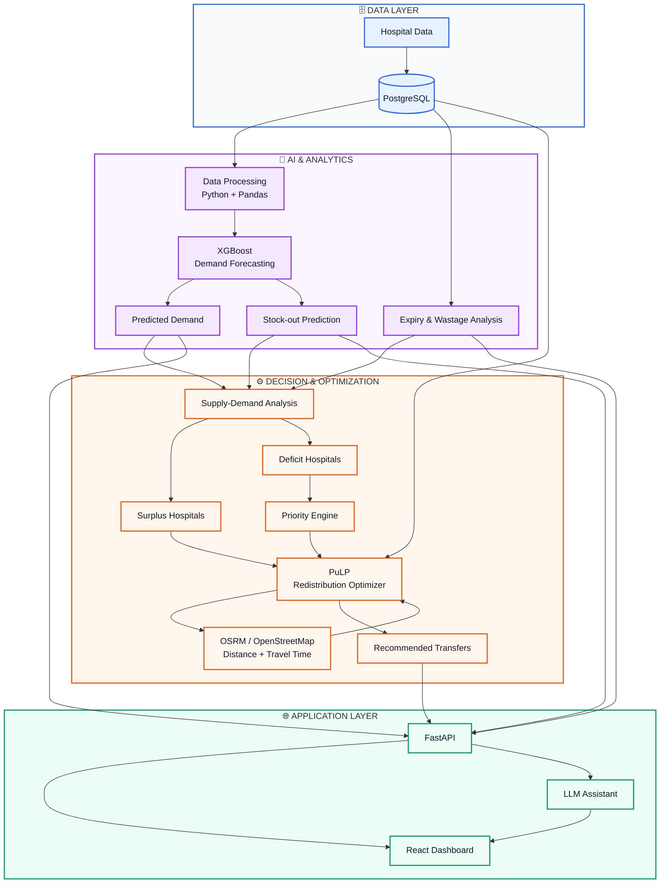
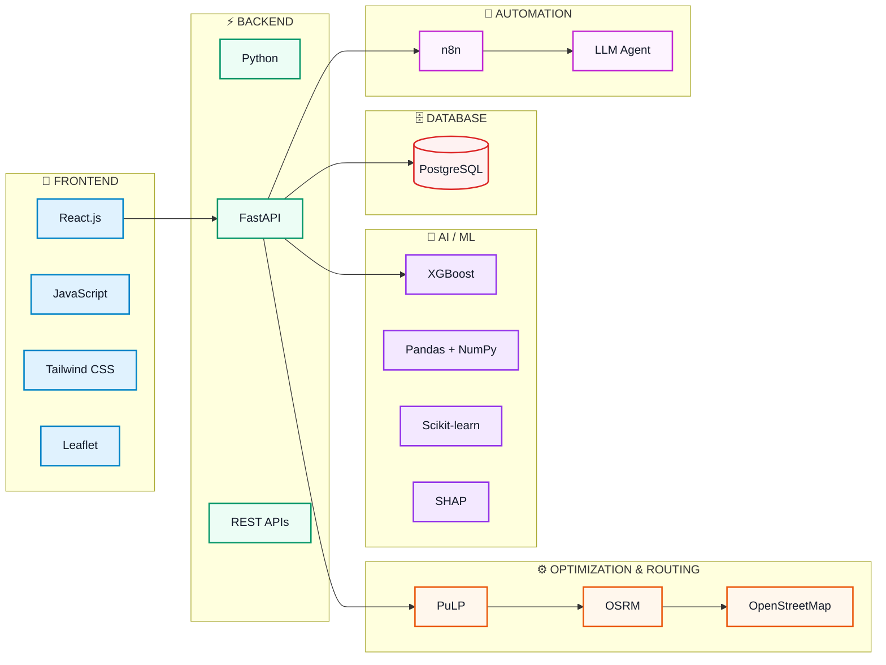
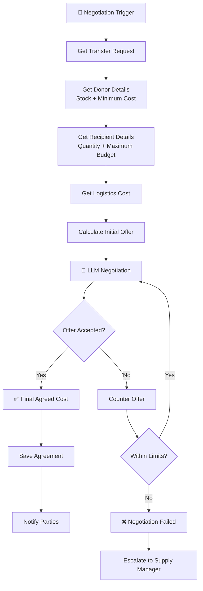

# SINGULARITY — AI for Medical Supply Intelligence

> **Predict before it happens:** forecast medical-supply demand, detect shortage/expiry risk, and recommend practical redistribution between healthcare facilities.

## Overview

SINGULARITY is a software-only AI system for medical supply intelligence. It combines demand forecasting, shortage-risk analysis, expiry/wastage detection, facility prioritisation, and optimisation to answer:

> **What is needed, where, and when will it run out?**

The current prototype uses **XGBoost** for demand forecasting and **PuLP** for redistribution optimisation. **PostgreSQL** is the system source of truth, **FastAPI** exposes backend APIs, **React** provides the dashboard, and **n8n** is used for workflow automation and cost-negotiation orchestration.

## System Architecture



## Tech Stack



### Stack summary

```text
Frontend       → React.js, JavaScript, Tailwind CSS, Leaflet
Backend        → Python, FastAPI, REST APIs
ML             → XGBoost, Pandas, NumPy, scikit-learn, SHAP
Optimization   → PuLP
Routing        → OSRM, OpenStreetMap
Database       → PostgreSQL
Automation     → n8n
Assistant      → LLM
```

## ML Workflow

```text
Historical / Current Data
        ↓
Pandas preprocessing
        ↓
Feature engineering
        ↓
X = demand-related features
        y = future_demand
        ↓
Chronological 80% / 20% split
        ↓
Scikit-learn preprocessing pipeline
        ↓
XGBoost Regressor
        ↓
Evaluation: MAE / RMSE / R²
        ↓
model.pkl
        ↓
Prediction on new hospital-supply data
        ↓
Predicted demand
        ↓
Stock-out / shortage analysis
        ↓
PuLP redistribution input
```

### Current training target

The current prototype dataset uses:

```text
y = future_demand
```

The model learns:

> Given current inventory, consumption, patient load, emergency demand, outbreak signals, medicine/facility information, and related features, predict future medicine demand.

### Main feature groups

```text
Location         → latitude, longitude
Inventory        → current_stock, safety_stock
Demand           → consumption
Healthcare load  → patient_load, emergency_demand
Signals          → outbreak_indicator
Supply           → lead_time_days
Identity         → hospital_id, hospital_name, region_type
Medicine         → medicine_id, medicine_name, medicine_category
Time             → year, month, week_of_year, day_of_week, quarter
```

`latitude` and `longitude` are included as context/features and are also important later for routing and redistribution.

## Prediction vs Training

The model is **not retrained on every transaction**.

```text
New Transaction
      ↓
Update PostgreSQL
      ↓
Generate current features
      ↓
Load model.pkl
      ↓
Predict future demand
      ↓
Update stock-out risk
```

Recommended operating pattern:

```text
Every important inventory/demand event → run prediction
Scheduled monitoring               → full risk/redistribution scan
Weekly / monthly                    → retrain model when enough new history exists
```

## Redistribution Workflow

```text
Predicted Demand
      ↓
Current Stock + Safety Stock
      ↓
Supply-Demand Gap
      ↓
Surplus Hospitals + Deficit Hospitals
      ↓
Priority Engine
      ↓
Expiry + Transport Feasibility
      ↓
PuLP
      ↓
Recommended Transfer
```

### PuLP input

Typical optimisation inputs include:

```text
donor_surplus
recipient_requirement
priority_score
expiry_days
transport_time
transport_cost
safety_stock
transfer limits
```

### PuLP output

Example:

```text
Hospital C → Hospital A : 1,800 units
Hospital C → Hospital B :   700 units
```

PuLP **optimises the decision**; it is not an ML model and does not require training.

## Transport Feasibility

Hospital coordinates can be passed to **OSRM/OpenStreetMap** to obtain practical road distance and estimated travel time.

```text
Hospital latitude/longitude
        ↓
OSRM
        ↓
Distance + ETA
        ↓
Redistribution feasibility
```

Example constraint:

```text
transport_time > time_until_expiry
→ reject transfer
```

## n8n Cost-Negotiation Workflow

n8n is used for automation/orchestration **after a feasible transfer recommendation exists**.



> **Safety rule:** the LLM negotiates only within hard cost/authority limits. It must not override medical priority, inventory, expiry, or feasibility constraints.

## Database Model

Core PostgreSQL entities:

```text
Hospital
Medicine
Inventory
Batch
DemandHistory
Forecast
Priority
Supplier
SupplyOrder
Transfer
Negotiation
```

`Batch` is separate from `Inventory` because expiry is batch-specific.

## Dataset

### Current prototype

The current repository can use the generated prototype file:

```text
medical_demand_training_90.csv
```

It contains 90 rows with weekly hospital-medicine observations and a supervised-learning target:

```text
future_demand
```

### Reference medicine master data

A medicine master dataset can provide attributes such as:

```text
id
name
price(₹)
Is_discontinued
manufacturer_name
type
pack_size_label
short_composition1
short_composition2
substitute0
```

These fields are useful for medicine metadata, substitutes, criticality logic, and database joins, but they are **not by themselves a demand-forecasting dataset**.

For the final model, historical usage/consumption and signal data should be preferred over purely descriptive medicine metadata.

## Project Structure

Recommended `BackendAI` layout:

```text
BackendAI/
├── data/
│   └── medical_demand_training_90.csv
├── models/
│   └── model.pkl
├── src/
│   ├── preprocessing.py
│   ├── features.py
│   ├── train.py
│   ├── predict.py
│   ├── forecasting.py
│   ├── stockout.py
│   ├── expiry.py
│   ├── priority.py
│   └── optimizer.py
├── api/
│   └── main.py
├── requirements.txt
└── README.md
```

## Installation

```bash
python -m venv .venv
```

### Windows

```bash
.venv\Scripts\activate
```

### Linux / macOS

```bash
source .venv/bin/activate
```

Install dependencies:

```bash
pip install pandas numpy scikit-learn xgboost joblib fastapi uvicorn pulp
```

## Model Training

```bash
python src/train.py
```

Expected output:

```text
Train: 80%
Test : 20%
MAE  : ...
RMSE : ...
R²   : ...
Saved model: models/model.pkl
```

## Prediction

```bash
python src/predict.py
```

The prediction layer should produce at least:

```text
hospital_id
medicine_id
predicted_future_demand
predicted_daily_demand
days_to_stockout
```

These results are then available to the shortage and redistribution layers.

## Core Decision Logic

The system separates three different responsibilities:

| Component | Responsibility |
|---|---|
| **XGBoost** | Predict future demand |
| **Priority Engine** | Determine which shortages are more urgent |
| **PuLP** | Decide feasible stock movements |
| **OSRM** | Supply travel distance/ETA |
| **n8n** | Automate negotiation/notification workflows |
| **PostgreSQL** | Store system state and results |

## Key Principles

- **Prediction first, action second.**
- Do not retrain the ML model for every transaction.
- Maintain hospital **safety stock**.
- Do not transfer expired or infeasible stock.
- Do not use price/payment as the primary medical-priority rule.
- Use patient load, emergency demand, stock-out urgency, medicine criticality, and alternatives for prioritisation.
- Keep hard safety/feasibility constraints separate from soft optimisation preferences.
- Show the reason behind every recommended redistribution.
- Preserve an audit trail of forecasts, decisions, transfers, and negotiations.

## Expected End-to-End Output

The dashboard should be able to answer:

```text
What medicine is at risk?
Where is it at risk?
When will it run out?
Which hospital has usable surplus?
Which facility should receive it first?
Can the transfer arrive in time?
How much should be moved?
What is the estimated/negotiated cost?
Why was this action recommended?
```

## Project

Repository: https://github.com/Abhinanda-Shetty/Singularity
