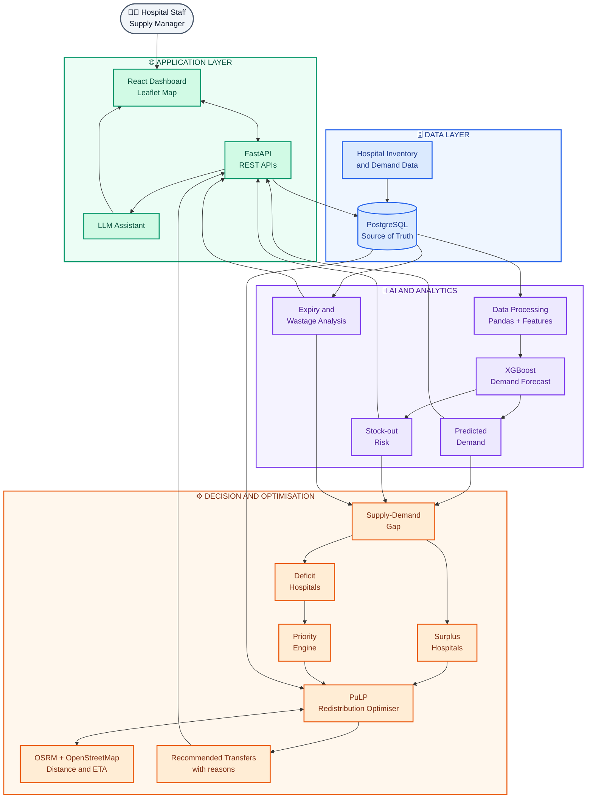
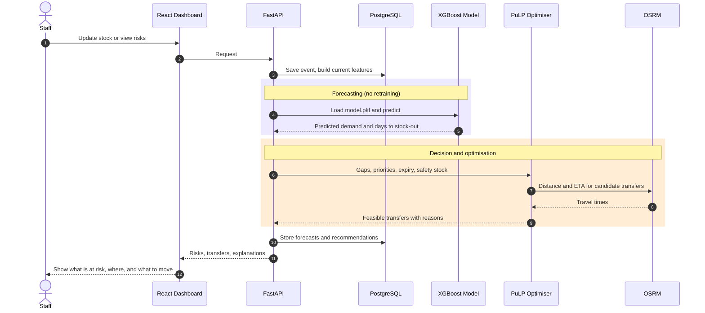
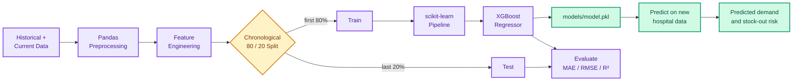
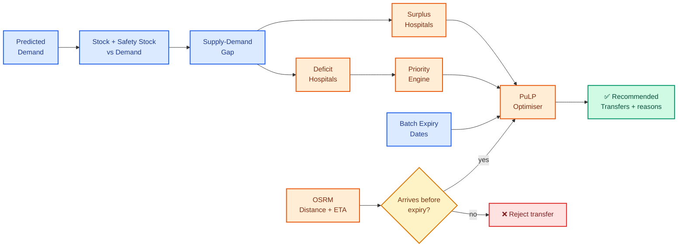

<div align="center">

# 🌐 SINGULARITY

### AI for Medical Supply Intelligence

**Predict before it happens.** Forecast medicine demand, detect shortage and expiry risk, and recommend practical stock redistribution between healthcare facilities.

</div>

---

## 📌 Table of Contents

- [The Problem](#-the-problem)
- [What Singularity Does](#-what-singularity-does)
- [System Architecture](#-system-architecture)
- [Runtime Flow](#-runtime-flow)
- [Tech Stack](#-tech-stack)
- [How the ML Works](#-how-the-ml-works)
- [Redistribution Engine](#-redistribution-engine)
- [Getting Started](#-getting-started)
- [Project Structure](#-project-structure)
- [Design Principles](#-design-principles)
- [Roadmap](#-roadmap)
- [Known Limitations](#-known-limitations)

---

## 🚨 The Problem

Hospitals run out of critical medicines while a nearby facility holds surplus that quietly expires. Stock decisions are usually reactive: someone notices a shortage *after* it happens.

Singularity answers one question ahead of time:

> **What is needed, where, and when will it run out?**

---

## ✨ What Singularity Does

| Capability | Description |
|---|---|
| 📈 **Demand forecasting** | XGBoost predicts future demand per hospital and medicine |
| ⏳ **Stock-out prediction** | Estimates days until stock runs out |
| 🗑️ **Expiry and wastage detection** | Flags batches likely to expire unused |
| 🏥 **Facility prioritisation** | Ranks shortages by patient load, emergency demand and criticality |
| 🔁 **Redistribution optimiser** | PuLP recommends which hospital sends how much to whom |
| 🚚 **Transport feasibility** | OSRM checks that a transfer arrives before expiry |
| 💬 **LLM assistant** | Plain-language answers on the dashboard |

---

## 🏗️ System Architecture



---

## 🔄 Runtime Flow

What happens when a new inventory event arrives:



---

## 🧰 Tech Stack

| Layer | Technology |
|---|---|
| **Frontend** | React.js, Tailwind CSS, Leaflet |
| **Backend** | Python, FastAPI, REST |
| **ML** | XGBoost, Pandas, NumPy, scikit-learn, SHAP |
| **Optimisation** | PuLP |
| **Routing** | OSRM, OpenStreetMap |
| **Database** | PostgreSQL |
| **Assistant** | LLM |

---

## 🤖 How the ML Works

The model learns:

> *Given current stock, consumption, patient load, emergency demand, outbreak signals and medicine / facility context, predict future medicine demand.*

**Target:** `future_demand`



### Feature groups

| Group | Features |
|---|---|
| Inventory | `current_stock`, `safety_stock` |
| Demand | `consumption` |
| Healthcare load | `patient_load`, `emergency_demand` |
| Signals | `outbreak_indicator` |
| Supply | `lead_time_days` |
| Context | `region_type`, `medicine_category` |
| Time | `month`, `week_of_year`, `quarter` |

### Prediction output

`python src/predict.py` produces, per hospital and medicine:

`predicted_future_demand` · `predicted_daily_demand` · `current_stock` · `safety_stock` · `days_to_stockout`

> The model is **not retrained on every transaction**. Predictions run on each important inventory event; retraining happens weekly or monthly once enough new history exists.

### Model results

| Metric | Held-out test set |
|---|---|
| MAE | _fill in from `train.py` output_ |
| RMSE | _fill in from `train.py` output_ |
| R² | _fill in from `train.py` output_ |

> ⚠️ Use the **Test Metrics** printed by `train.py` (chronological held-out 20%). Scores from `predict.py` on the training CSV are in-sample and shouldn't be reported as accuracy.

---

## 🔁 Redistribution Engine



**Example output**

```text
Hospital C → Hospital A : 1,800 units
Hospital C → Hospital B :   700 units
```

PuLP optimises the *decision*. It is not an ML model and needs no training.

---

## 🚀 Getting Started

### Prerequisites

- Python 3.10+
- Node.js (for the dashboard)
- PostgreSQL

### Setup

```bash
git clone https://github.com/Abhinanda-Shetty/Singularity.git
cd Singularity
git checkout abhi
cd BackendAI

python -m venv .venv
```

**Windows:** `.venv\Scripts\activate`  **Linux / macOS:** `source .venv/bin/activate`

```bash
pip install pandas numpy scikit-learn xgboost joblib fastapi uvicorn pulp shap requests
```

### Train and predict

```bash
python src/train.py      # trains, prints test metrics, saves models/model.pkl
python src/predict.py    # writes data/predictions.csv
```

### Run the API

```bash
uvicorn api.main:app --reload
```

---

## 📁 Project Structure

```text
BackendAI/
├── data/
│   ├── medical_demand_training_90.csv
│   ├── test_predictions.csv
│   └── predictions.csv
├── models/
│   └── model.pkl
├── src/
│   ├── preprocessing.py
│   ├── features.py
│   ├── train.py
│   ├── predict.py
│   ├── forecasting.py
│   ├── stockout.py
│   ├── expiry.py
│   ├── priority.py
│   └── optimizer.py
├── api/
│   └── main.py
├── requirements.txt
└── README.md
```

---

## 🧭 Design Principles

- **Prediction first, action second.**
- Never retrain per transaction.
- Always protect hospital **safety stock**.
- Never transfer expired or infeasible stock.
- Price is never the primary medical-priority rule.
- Prioritise by patient load, emergency demand, stock-out urgency, medicine criticality and alternatives.
- Keep hard safety constraints separate from soft optimisation preferences.
- **Explain every recommendation.**
- Keep an audit trail of forecasts, decisions and transfers.

---

## 🛣️ Roadmap

- [ ] Add per-pair demand history features (lags, rolling mean / std)
- [ ] Rolling-origin cross-validation and naive baselines
- [ ] Quantile forecasts (P10 / P50 / P90) for uncertainty-based safety stock
- [ ] Lead-time-aware stock-out alerts and reorder suggestions
- [ ] Substitute-aware shortage handling using medicine master data
- [ ] FEFO (first-expiry-first-out) redistribution with batch-level expiry
- [ ] SHAP explanations on the dashboard
- [ ] What-if simulator (outbreak surge, supplier delay)
- [ ] Drift monitoring and automated retraining trigger

---

## ⚠️ Known Limitations

- The prototype dataset has **90 rows**, so the held-out test set is tiny and scores are noisy.
- The dataset is **synthetic**. Results reflect the generator, not real hospital behaviour, and need validation on real data.
- `predicted_daily_demand` is `future_demand / 7` (flat across the horizon).
- `days_to_stockout` does not yet account for lead time or incoming orders.
- The medicine master data describes medicines but is not a demand-forecasting dataset.

---

<div align="center">

**Singularity** · Predict before it happens

</div>
